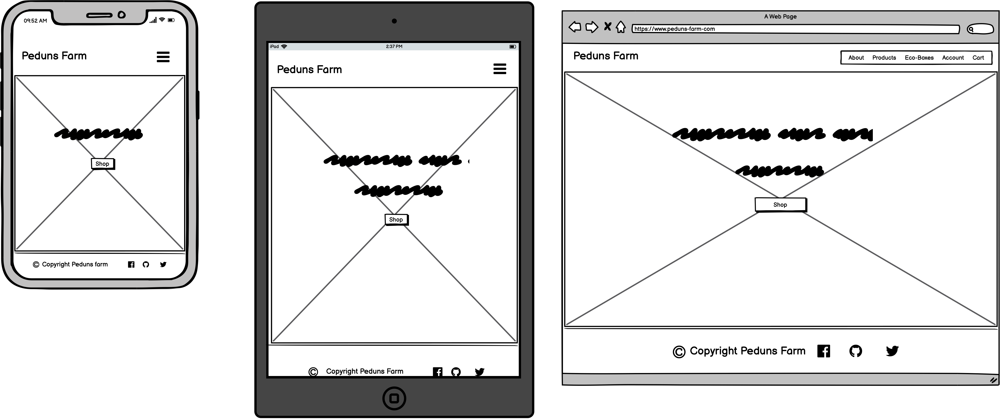

Click [here](https://peduns-farm.herokuapp.com/) for the deployed site.

# About  


## **Table of content** 

- [User Experience (UX)](#user-experience--ux-)
    - [Strategy](#strategy)
      - [User stories](#user-stories)
    - [Scope](#scope)
    - [Structure](#structure)
    - [Skeleton](#skeleton)
    - [Design](#design)
  - [Features](#features)
    - [Existing features](#existing-features)
    - [Future Development Features](#future-development-features)
    - [Failed Features](#failed-features)
  - [Technologies Used](#technologies-used)
    - [Languages](#languages)    
    - [Libraries, Frameworks and Templates](#libraries-frameworks-and-templates)
    - [Other technologies](#other-technologies)
    -  
  - [Testing](#testing)

- [Deployment](#deployment)
  - [Deploying to Heroku](#deploying-to-heroku)
  - [Forking](#forking)
  - [Making a Local Clone](#making-a-local-clone)

   - [Credits](#credits)
     - [Code](#code)
     - [Content](#content)
     - [Media](#media)
     - [Acknowledgment](#acknowledgments)

*** 

## User Experience (UX)
## Strategy

### User Stories 
* As a user I want to know what the farm is about 
* As a user I want to easily find eco boxes.
* As I user I want to know the price of the products.
* As a user I want to be able to find products of similar category
* As a user I want to be able to search for products by prize, so that I know what products are cheap and which are expensive
* As a user I want to be able to checkout easily and securely
* As a user I want to be able to use direrent payment methods
* As a User I want to save my details so I easily checkout next time 
* As a User I want to have a record of my purchase order
* As a User I want to be able to contact the farm 
* As a User I want to visit the farm 
* As a User I want to pick my own produce when possible
* As a User I want to have an online account 

### Clients Stories
* As an administrator, I can manage and maintain the e-commerce store.
* As an administrator, I can adjust any product.
* As an administrator, I can add more products.
* As an administrator, I can delete products.

### Future Implementations
#### User stories
* As a user I want to be able to use direrent payment methods
  - Other pyaments such as paypal, klarna can be implemented in the future to give users other secure payment options.

#### [Back to top](<#table-of-content>)
***
## Scope

User expectations
* Purchase products
* Adjust products quantity
* Delete products
* Create user account
* Secure payment processing
* Contact the farm
* Stay up to date by following the farm via social media
* Privacy Policy
* Accessability statement


#### [Back to top](<#table-of-content>)
***
## Structure
#### Database
This site uses PostgreSQL provided by heroku.

#### [Back to top](<#table-of-content>)
***
## Skeleton
### Wireframes
  Wireframes were created using the [Balsamiq](https://balsamiq.com/wireframes/) software.
  * **Home**
  


  All Wireframes
  * [About Us](static/documents/wireframes/about-us.png)
  * [Fruit Picking](static/documents/wireframes/fruit-picking.png)
  * [Contact Us](static/documents/wireframes/contact-us.png)
  * [Products](static/documents/wireframes/products.png)
  * [Cart](static/documents/wireframes/cart.png)
  * [login](static/documents/wireframes/login.png)
  * [Profile](static/documents/wireframes/profile.png)
  * [Product Management](static/documents/wireframes/product-management.png)
  * [Register](static/documents/wireframes/register.png)
  * [Checkout](static/documents/wireframes/checkout.png)
  * [Password Reset](static/documents/wireframes/password-reset.png)

A pdf of the wireframes can be found [here](static/documenst/wireframes/peduns-farm.pdf), by clicking on the download button in Github. (**Please Note:** _[Adobe Acrobat Reader](https://get.adobe.com/reader/) is required to view files in pdf format_).


#### [Back to top](<#table-of-content>)
***
## Design
The webiste's design and layout is based on fonts, colors, wireframes, images and icons.

### Fonts
* Google Fonts **Oswald** is used as the main font and **sans-serif** as the fallback font.

### Color Scheme
The color palatte for this project is very minimal, with the default bg-light for navbar and footer.

* **border-botton: #21b888;** 
    * used to repalve the horizontal rule on all titles. This shade of green is also a represenation of thgreen color in nature and also most farms.

#### [Back to top](<#table-of-content>)
***
## Features
### Existing Features
Below are some of the existing features
* Responsive Navbar
* Social Media links
* Registration page
* Contact us page
* Log in page
* user profile page
* Search functionality
* Admin profile
* Secure Checkout

### Future Development Features
Below are some features to be implemented at a later stage
* Social media login/registration functionality
* Paypal payments 


#### [Back to top](<#table-of-content>)
***
## Technologies Used
### Languages
* HTML5
* CSS3
* JavaScript
* Python
### Libraries, Frameworks and Templates
* [Django](https://docs.djangoproject.com/en/4.0/)
* [jquery](https://jquery.com/)
* [jinja templates](https://jinja.palletsprojects.com/)
* [Bootstrap](https://getbootstrap.com/docs/4.0/getting-started/introduction/)

### Other Technologies
* [Amazon AWS](https://aws.amazon.com/)
* [Stripe](https://stripe.com/gb)
* [Font Awesome](https://fontawesome.com/)

### Database Used
* [Postgresql](https://www.postgresql.org/) provided by Heroku

#### [Back to top](<#table-of-content>)
***
## Testing


#### [Back to top](<#table-of-content>)
***

## Deployment

**Deploying to [Heroku](https://dashboard.heroku.com/)**

* You will need an account to sign up to [Heroku](https://www.heroku.com)
* Once logged in click the create new app button
* Select the region closest to you and give the APP a name
* Set your deployment method to 'GitHub'
* Connect to GitHub and login
* Search for the repository you wish to deploy from
* You will need to head to settings and click 'Config Vars' to set the enviromnents.
    * You will now need to set up your Configuration Vars the same way as you did for your env.py
    - **Set environment in Heroku App** 
      - Go to settings, then click on reveal config vars
      - Enter your key value pairs as per your settings.py file, including AWS and STRIPE
    
* Make sure you have set up your Procfile and you have updated the requirements.txt prior to deploying    
 - Enable automatic deploys      
* Once it is deployed you will be able to view the app

## AWS
Amazon Web Services, specifically s3 bucket is used to store the media files (A user account is required to use this service)
  - Creating an acount at https://aws.amazon.com/

  - Create an s3 bucket, follow the documentation of how to set your zone, permission ...

  - Create a user group and its policy

  - create a user for this group

  - Install django-storage/boto3, connecting the bucket to the repo by adding storage to the apps in setting.py. adding the following to my setting.py :

  **Bucket Configurations**

          
            AWS_STORAGE_BUCKET_NAME = 'peduns-farm'
            AWS_S3_REGION_NAME = 'eu-north-1'
            AWS_ACCESS_KEY_ID = os.environ.get('AWS_ACCESS_KEY_ID')
            AWS_SECRET_ACCESS_KEY = os.environ.get('AWS_SECRET_ACCESS_KEY')
            AWS_S3_CUSTOM_DOMAIN = f'{AWS_STORAGE_BUCKET_NAME}.s3.amazonaws.com'

  **Static and media files**

            STATICFILES_STORAGE = 'custom_storages.StaticStorage'
            STATICFILES_LOCATION = 'static'
            DEFAULT_FILE_STORAGE = 'custom_storages.MediaStorage'
            MEDIAFILES_LOCATION = 'media'

  **Override static and media URLs in production**

            STATIC_URL = f'https://{AWS_S3_CUSTOM_DOMAIN}/{STATICFILES_LOCATION}/'
            MEDIA_URL = f'https://{AWS_S3_CUSTOM_DOMAIN}/{MEDIAFILES_LOCATION}/'


### Forking

Forking the GitHub Repository

By forking the GitHub Repository, you can make a copy of the original repository in your own GitHub account.  This means we can view or make changes without making the changes affecting the original.

      You can make a copy of the GitHub Repository by "forking" the original repository onto your own account, where changes can be made without affecting the original repository by taking the following steps: 

   
1. Login to your account on [Github](https://github.com/).
2. Locate the [Repository](https://github.com/Joan-Amudu/Peduns-Farm) used for this project.
3. On the right-hand side of the Repository name, you'll see the 'Fork' button.
4. This will create a copy in your personal repository.
5. Once you're finished making changes, return to original repository and press 'New Pull Request' to request your changes to be merged into the original project.

### Making a Local Clone

1. Log in to [GitHub]() and 
2. Locate the [GitHub Repository](https://github.com/Joan-Amudu/Peduns-Farm).
3. Under the repository name, click Code.
4. To clone the repository, select HTTPS and copy the link.
5. Open Git Bash.
6. Change the current working directory to the location where you want the cloned directory to be made.
7. Type **git clone**, and then paste the URL you copied in Step 4.

```
 git clone https://github.com/YOUR-USERNAME/YOUR-REPOSITORY
```
    * To clone this particular repository:
    git clone https://github.com/Joan-Amudu/Peduns-Farm

7. Press Enter. Your local clone will be created.
8. Change into the directory being created.

Click [Here](https://help.github.com/en/github/creating-cloning-and-archiving-repositories/cloning-a-repository) for more information about cloning repositories. 


#### [Back to top](<#table-of-content>)
***
## Credits

### Code
This project is only possible because of the contibution of others to the community. While I have used code from external sources and past projects, I always aim to customise the code to make it fit well with my own project, and as such, it is difficult to pin point exact lines of code from external soucres. However, where exact code has been used and not altered at all, I have added comments and acknowledge the source within the code itself.

#### Overall Structure
* The overall structure and code of this porject was derived from following Code Institutes's [Boutique Ado.](https://github.com/Code-Institute-Solutions/boutique_ado_v1)


#### Footer
* The footer was taken from my previous [Milestone Project](https://github.com/Joan-Amudu/Wild-Aussie)

#### Privacy Policy and Accessablity Statement
    These statments were derived from previous hackathons I had participated in, specifically
    * [Bust IT: Cancer Without Borders](https://vanessacleary.github.io/W-I-T-IT-LAB-Breast-Cancer-Awareness/)
    * [SODA Apply](https://soda-apply.herokuapp.com/)

### Images

#### [Pexels](https://www.pexels.com/) 
* [Ella Olson](https://www.pexels.com/@ella-olsson-572949)
* [Alesia Kozik](https://www.pexels.com/@alesiakozik)
* [Antarar Verma](https://www.pexels.com/@antaraphotoshoots)
* [Pixabay](https://www.pexels.com/@pixabay)
* [Engin Akyurt](https://www.pexels.com/@enginakyurt)
* [Casa Norte](https://www.pexels.com/@casa-norte-23254957)
* [Lisa](https://www.pexels.com/@fotios-photos)
* [Aphiwat chuangchoem](https://www.pexels.com/@fecundap6)
* [Townsend Walton](https://www.pexels.com/@townsend-walton-6231368)
* [Mali madder](https://www.pexels.com/@mali)


#### [Back to top](<#table-of-content>)
***
## Acknowledgements
I appreciate the guidance is recieved from my mentor Brain Macharia


#### [Back to top](<#table-of-content>)
***