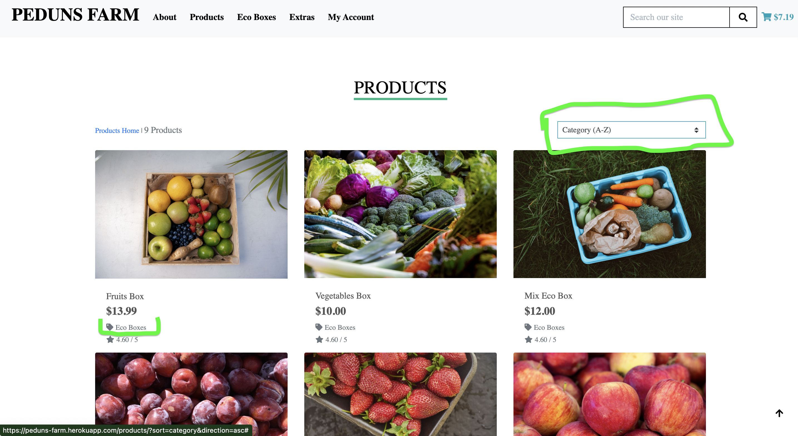
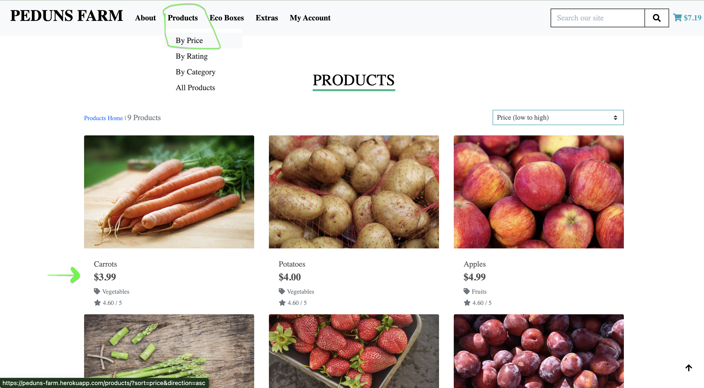
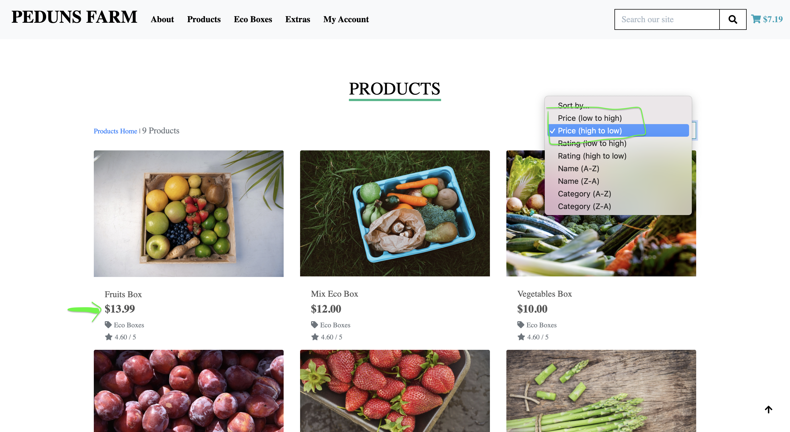
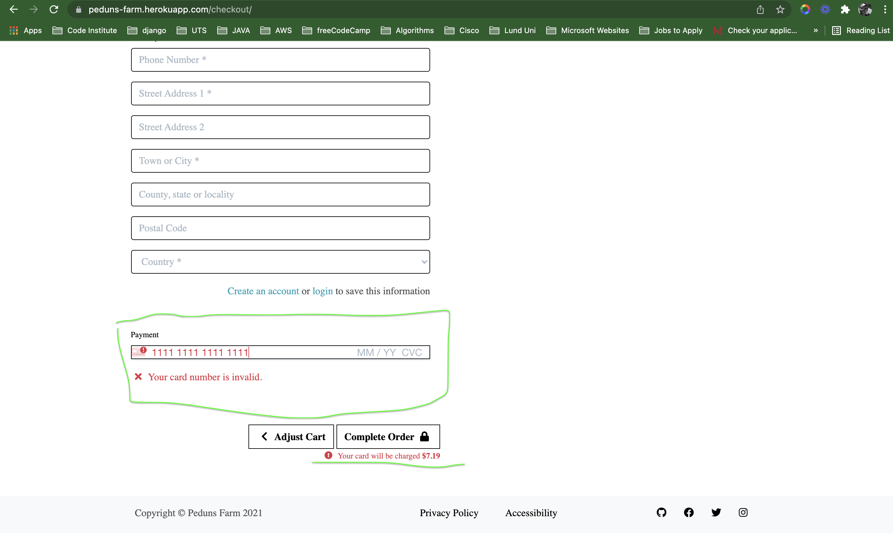
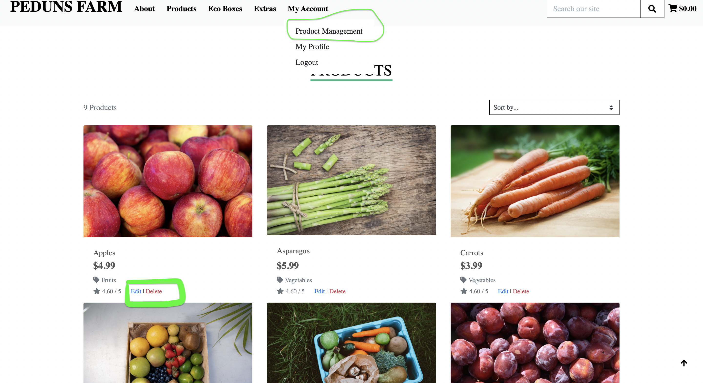

# **Testing**

## **Table of content** 
- [Functionality](#functionality)
- [Browser Compatibility](#browser-compatibility)
- [Responsiveness](#responsiveness)
- [User Stories](#user-stories)

## Functionality
|   **Test Case**  |   **Test Label**  |  **Test Action**  |  **Expected Outcome**   |  **Test Outcome** |  **Comments**       |
|----------------|----------------|-------------------------------|-----------------------------|-----------------------------|-----------------------------|
|TC001|**NavBar:**|Click on Brand Name from page |   Direct the user back to the home page | Pass |
|TC002|         | Click on Nav-items | Dropdown to reveal other nav-items |Pass |
|TC003|          |Click search icon without any input| Error message |Pass |
|TC004||Click on shopping cart icon| Directs users to shopping cart page | Pass |
|TC005|**NavBar Responsiveness**| Reduce screen size to small and medium | NavBar collpases to reveal burger icon|Pass |
|TC006|**Footer**| Click on social media icons| opens respective social media webisted on a new tab| Pass |
|TC007||Click on Privacy| Directs user to privacy statement|Pass |
|TC008||Click on Accessability|Direct user to Accessability statement|Pass |
|TC009|**Home**|Click Shop Now button| Direct user to products page|Pass |
|TC0010|**About Nav-Item**|Click About Nav-Item|Reveal dropdown items: About Us, Fruit Picking and Contact Us|Pass |
|TC0011|**About Us**|Click About Us dropdown-item| Directs the user to About Us page | Pass |
|TC0012||Click Any recommended products| Directs the user to the product details of the respective product | Pass | See ----
|TC0013|**Fruit Picking**|Click Fruit Picking dropdown-item |Direct user to fruit picking page|Pass
|TC0014||Click Book Button with empty form|Popup warning message asking user to fill in form fields|Pass|
|TC0015||Click Book button with filled in form|Confirmation Modal|Pass|
|TC0016||Click Back home button on confirmation modal|Re-directs user to home page|Pass|
|TC0017|**Contact Us**|Click Contact us dropdown-item|Direct user to Contact Us page|Pass|
|TC0018||Click Submit button with empty form|Popup warning message asking user to fill in form fields|Pass|
|TC0019||Click Submit button with filled in form|Confirmation Modal|Pass|
|TC0020|**Products**|Click products nav-item| Reveal dropdown items|Pass|
|TC0021||Click All Products dropdown-item|Directs user to products page with all products displayed|Pass|
|TC0022||Click By Price dropdown-item|Sorts all products by price|Pass|Sort selector shows price(low to high)
|TC0023||Click By rating dropdown-item|Sorts all products by rating|Pass|Sort selector shows Rating(high to low)
|TC0024||Click By Catergory dropdown|Sorts all products by their category|Pass|Sort selector shows Category(A-Z)
|TC0025|**Product Details**|Click any product|Directs user to Product detail |Pass|
|TC0026||Click minus quantity button|Decreases the quantity|Pass|
|TC0027||Click minus quantity button|Button disables when quantity reduced to zero|Pass|
|TC0028||Click plus quantity button|Increases quantity|Pass|
|TC0029||Manually input valid quantity number (0-99)|Value accepted and can be added to cart|Pass|
|TC0030||Manually input invalid quantity number(e.g -1 or 100) |Warning message when adding to cart|Pass|
|TC0031||Click Keep Shopping button|Re-direct user to products page|Pass
|TC0032||Click add to cart|Product added to cart, preview of shopping cart and amount displayed|Pass|
|TC0033||Click add to cart|Success Toast message|Pass|
|TC0034||Click plus button to increase the number of quantity|Shopping cart preview and amount updated accordingly| Pass|
|TC0035|**Shopping Cart**|CLick cart icon from navbar|Direct user to shopping cart page|Pass|
|TC0036||If shopping cart is empty, click keep shopping|Direct user to products page |Pass
|TC0037||If products exist, click minus or plus buttons to reduce or increase quantity and click update|Quantity increases or decreases accordingly and price updated as well|Pass|
|TC0038||Clicking minus button to 0 quantity and click update|Product is deleted from shopping cart|Pass| Success alert message  displayed
|TC0039||Click Secure Checkout button|Directs user to Checkout page|Pass| Checkout page displays checkout form and order summary
|TC0040|**Checkout Page**|Click Checkout button with empty form|Form will not submit as all required fields need to be filled out|Pass|Popup warning message asking user to fill in form fields
|TC0041||Enter invalid acrd number on card payment field| Your card number is invalid message is displayed |Pass|
|TC0042||Enter valid card payment details|Payment processing is displayed|Pass|Sucessful payment after processing with complted order details displayed.
|TC0043|**Product Management**|Click Product management dropdown item|Directs Admin to add a product page|Pass|Product Management details only visible to staff with admin previledges
|TC0044||Add product details without image|Default no-image image will be displayed|Pass|
|TC0045||Click edit on any product|Directs Admin to edit product page|Pass|Alert message informing the admin of the specific product they are editing
|TC0046||Click delete on any product|Directs Adim to delete product manage|Pass|
|TC0047||Delete product page: click yes|Deletes the product|Pass|
|TC0048||Delete product page: click Cancel|Re-directs Admin back to products page|Pass|

#### [Back to top](<#table-of-content>)

## Browser Compatibility
This project was tested successfully on the following browsers
* Google Chrome
* Microsoft Edge
* Firefox
* Safari
#### [Back to top](<#table-of-content>)

## Responsiveness
This project was built using [Bootstrap 4](https://getbootstrap.com/docs/4.6/getting-started/introduction/), which is used to quickly design and customize responsive mobile-first sites. 
#### [Back to top](<#table-of-content>)

## User Stories
### User Stories 
* As a user I want to know what the farm is about
    - This is achieved from the About us section.
    - Users can also follow the farms social media accounts
* As a user I want to easily find eco boxes.
    - The nav bar has an eco boxes nav link which directs the user to all available eco boxex
* As I user I want to know the price of the products.
    - Prices are displayed on all products. Furthermore, users can shop and sort products by prices.
* As a user I want to be able to find products of similar category
    - This is achieved through the By categories dropdown item, which sorts and dispalys products by their category

    

* As a user I want to be able to search for products by price, so that I know what products are cheap and which are expensive
    - This can be achieves´d in two ways: 
    - First, by using the products nav dropdown, users can select products by price. By deafult, products are sorted by price from low to high

        

    - The second option is to sort prices from the sort dropdown menu, here users can sort prices from low to high or high to low
        

* As a user I want to be able to checkout easily and securely
    - This site was developed to handle secure payments using scripe.
    - For example inavlid card numbers throw errors
        

* As a User I want to save my details so I easily checkout next time
    - By registering to the site, users will have a profile page where they can update their contact information any time.
    - User profiles will aslo contain order histories.
* As a User I want to have a record of my purchase order
    - User profiles contain order histories.
* As a User I want to be able to contact the farm 
* As a User I want to visit the farm
    - A contact us page has information on the farms location. Users can aslo write to the farm via email or contact us form to enquire more about the farm, products and visiting policies.
    
* As a User I want to pick my own produce when possible
    - Through the Fruit picking booking page, users can book and vivit the farm when its open for visitors.
 

### Clients Stories
* As an administrator, I can manage and maintain the e-commerce store.
* As an administrator, I can adjust any product.
* As an administrator, I can add more products.
* As an administrator, I can delete products.
    - All client stories above are in relation to product management, and only registered staff member(Administrator) can manage the site. Product management functionality is only visible to staff.
    - Administrators can also adjust, edit or delete any products.

    
#### [Back to top](<#table-of-content>)